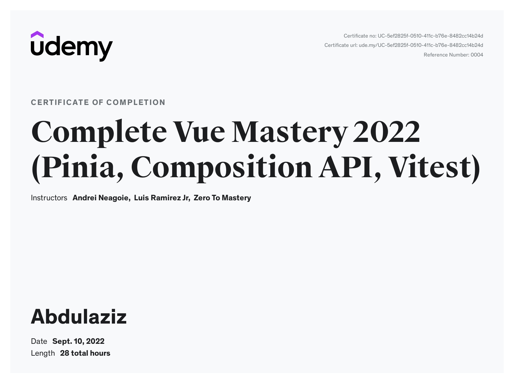

# Abdulaziz Makhmudov

## Contact info

-   Mail: abdulazizmakhmudov25@mail.com
-   Phone: +998905813340
-   Github: abumaybah
-   Telegram: @abumaybah

---

## About me

> I'am really keen on web development and that is why I am learning it. I have taken some udemy courses such JavaScript course of Jonas, HTML and CSS and Vue.js course of Andrei. That was great experience and I really liked parts where we had to find some solutions to problems by ourselves. Right now I am learning React on udemy, participating in RS School course ( currently at stage 1 ), and trying to get a job as a web developer. In near future I want to deep dive into backend development, I think it is interesting what is going on there. I really like web development in general.

---

## Skills

### HTML

-   Semantic and valid code
-   Using html5 tags

### CSS

-   Grid & Flexbox
-   Crosbrowser support
-   SASS & SCSS

### JavaScript

-   DOM & Events
-   How JS works behind the Scenes
-   Data Structure, Modern Operators & Strings
-   OOP
-   Asynchronous JS
-   MVC Architecture

### Vue.js

-   Pinia
-   VeeValidate
-   Routing, Router leave guards, Route transitions
-   Vuex
-   Composition API
-   Vitest

---

## Code examples

```
    const switchPlayer = function () {
        document.getElementById(`current--${activePlayer}`).textContent = 0;
        currentScore = 0;
        activePlayer = activePlayer === 0 ? 1 : 0;
        player0El.classList.toggle('player--active');
        player1El.classList.toggle('player--active');
    };
```

---

## Work experience and education

### Complete Vue Mastery 2022 ( Pinia, Compostion API, Vitest)

-   Understanding Reactivities with Proxies
-   Advanced Vue Components
-   Transitions & Animations
-   Pinia
-   VeeValidate ( Form Validation )
-   Routing, Router leave guards, Route transitions
-   Vuex
-   Custom directives
-   Progressive Web App
-   Performance and Optimization
-   Compostin API
-   Components Design Patterns
-   Testing Vue Apps (Vitest)

Code examples: https://github.com/abumaybah/music

### Tashkent University Of Information Technology in Fergana (currently second course)

#### Certificate



## English

> I have been watching all content on the Internet in English language, because I think there is much more useful information in English language than in other languages, so that is why I am trying to do everything in English language. I thing a have decent English level at least it is enough to communicate with other native or not native speakers out there.
